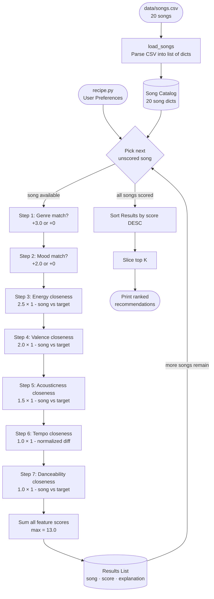

# Data Flow — Music Recommender Simulation

## Conceptual Map

```
┌─────────────────────────────────────────────────────────────────────┐
│  INPUT                                                              │
│                                                                     │
│   recipe.py                       data/songs.csv                   │
│   ┌──────────────────────┐        ┌───────────────────────────┐    │
│   │ User Preferences     │        │ 20 songs, 10 attributes   │    │
│   │  genre:  "lofi"      │        │ id, title, artist, genre, │    │
│   │  mood:   "focused"   │        │ mood, energy, tempo_bpm,  │    │
│   │  energy: 0.38        │        │ valence, danceability,    │    │
│   │  valence: 0.58       │        │ acousticness              │    │
│   │  acousticness: 0.80  │        └───────────────────────────┘    │
│   │  tempo_bpm: 78       │                    │                    │
│   │  danceability: 0.58  │                    ▼                    │
│   └──────────────────────┘           load_songs()                  │
│               │                  parses CSV → list of dicts        │
└───────────────┼──────────────────────────────┼─────────────────────┘
                │                              │
                └──────────────┬───────────────┘
                               ▼
┌─────────────────────────────────────────────────────────────────────┐
│  PROCESS — The Loop (one iteration = one song)                      │
│                                                                     │
│   For each song in the catalog (20 iterations total):              │
│                                                                     │
│   ┌─────────────────────────────────────────────────────────────┐  │
│   │ Step 1 — Categorical checks (binary: full points or zero)   │  │
│   │   genre match?  → +3.0  or  +0                             │  │
│   │   mood match?   → +2.0  or  +0                             │  │
│   ├─────────────────────────────────────────────────────────────┤  │
│   │ Step 2 — Numeric closeness (1 - |song_val - user_target|)  │  │
│   │   energy       → score × 2.5   (range 0.18 – 0.98)        │  │
│   │   valence      → score × 2.0   (range 0.22 – 0.88)        │  │
│   │   acousticness → score × 1.5   (range 0.03 – 0.97)        │  │
│   │   tempo_bpm    → score × 1.0   (normalized: min=54 max=180)│  │
│   │   danceability → score × 1.0   (range 0.22 – 0.95)        │  │
│   ├─────────────────────────────────────────────────────────────┤  │
│   │ Step 3 — Sum all feature scores                             │  │
│   │   total = step1 + step2   (max possible = 13.0)            │  │
│   │   attach (song, score, explanation) to results list        │  │
│   └─────────────────────────────────────────────────────────────┘  │
│                    ↑ repeat for next song                           │
└─────────────────────────────────────────────────────────────────────┘
                               │
                               ▼
┌─────────────────────────────────────────────────────────────────────┐
│  OUTPUT — The Ranking                                               │
│                                                                     │
│   Sort all 20 (song, score, explanation) tuples by score DESC      │
│   Slice top K  →  return to main.py  →  print to terminal          │
│                                                                     │
│   Example (late_night_study profile, k=5):                         │
│   1. Focus Flow        — 12.4  lofi  / focused / energy 0.40      │
│   2. Library Rain      — 11.9  lofi  / chill   / energy 0.35      │
│   3. Moonlight Study   — 10.2  classical / peaceful / energy 0.18  │
│   4. Old Dirt Road     —  9.1  folk  / melancholic / energy 0.25   │
│   5. Coffee Shop Stories—  8.7  jazz  / relaxed  / energy 0.37     │
└─────────────────────────────────────────────────────────────────────┘
```

---

## Mermaid Flowchart



---

## How a Single Song Moves Through the System

Take **"Midnight Coding"** (lofi, chill, energy=0.42) against the `late_night_study` profile:

| Step | Feature | Calculation | Points |
|---|---|---|---|
| 1 | genre | `"lofi" == "lofi"` → match | **+3.00** |
| 2 | mood | `"chill" != "focused"` → miss | +0.00 |
| 3 | energy | `2.5 × (1 - \|0.42 - 0.38\|)` = 2.5 × 0.96 | **+2.40** |
| 4 | valence | `2.0 × (1 - \|0.56 - 0.58\|)` = 2.0 × 0.98 | **+1.96** |
| 5 | acousticness | `1.5 × (1 - \|0.71 - 0.80\|)` = 1.5 × 0.91 | **+1.37** |
| 6 | tempo_bpm | `1.0 × (1 - \|0.19 - 0.19\|)` = 1.0 × 1.00 | **+1.00** |
| 7 | danceability | `1.0 × (1 - \|0.62 - 0.58\|)` = 1.0 × 0.96 | **+0.96** |
| | **Total** | | **10.69 / 13.0** |

The mood miss (-2.0 max) is the only real penalty — the song still ranks high because
genre, energy, acousticness, and tempo all closely match the profile.
