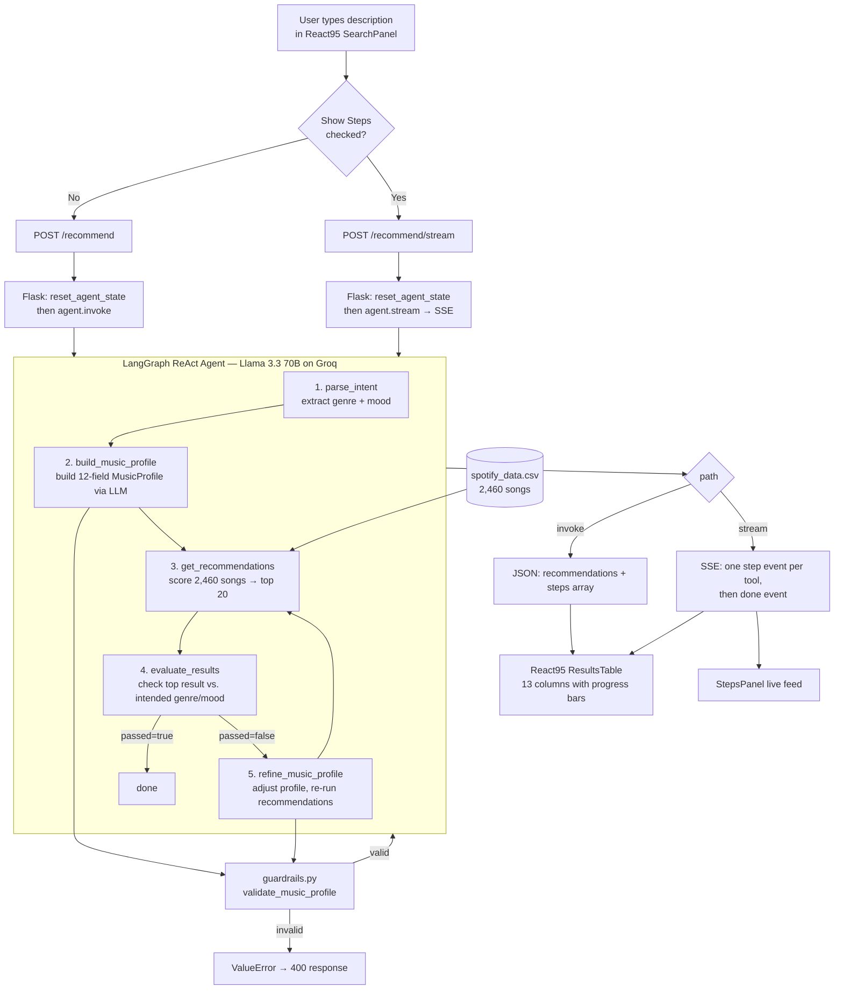
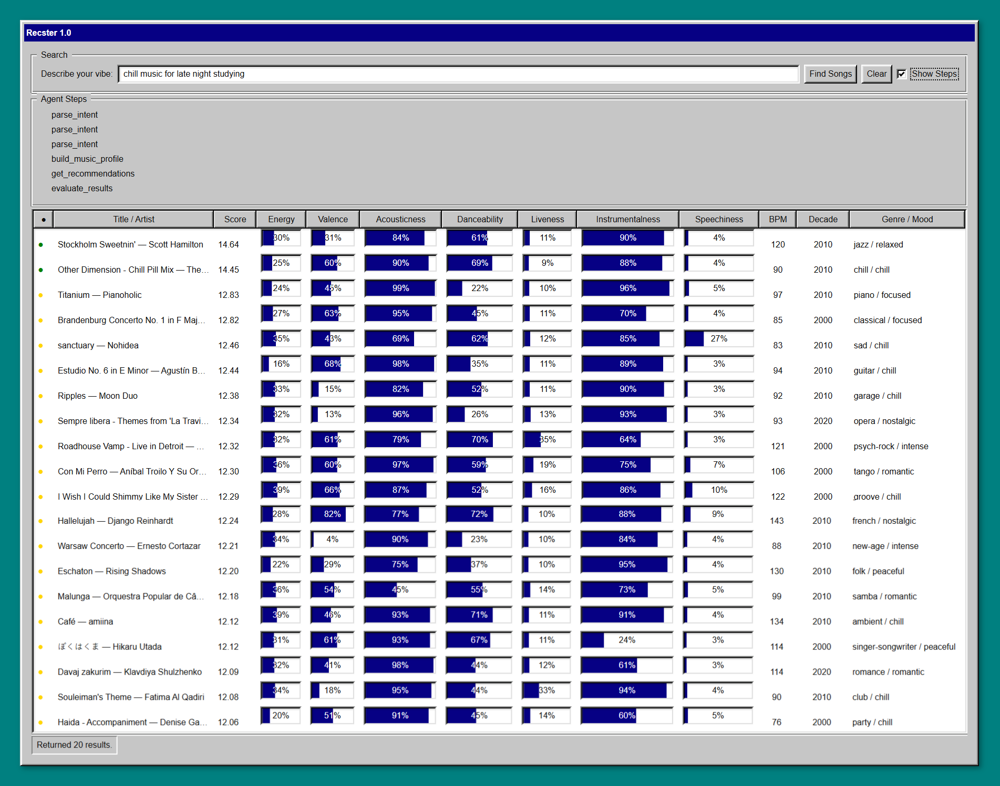
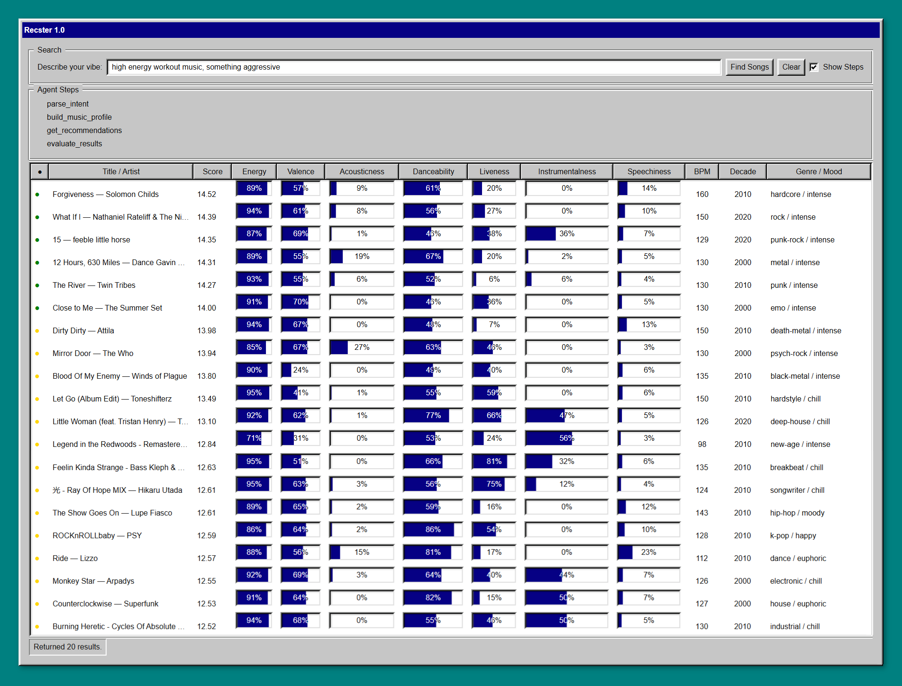
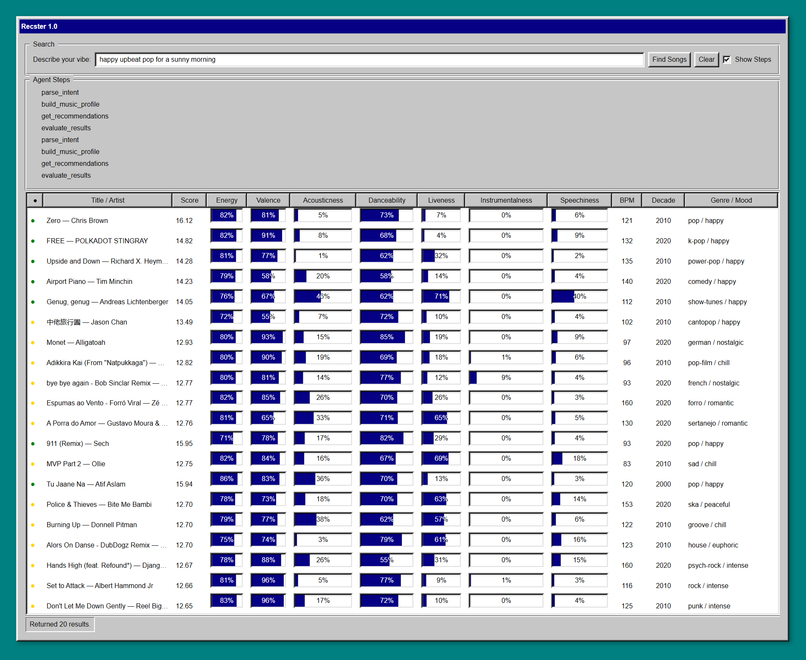
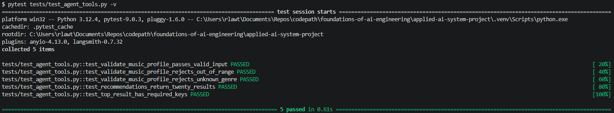
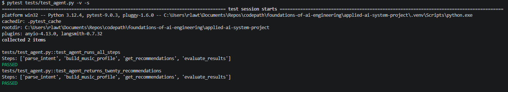
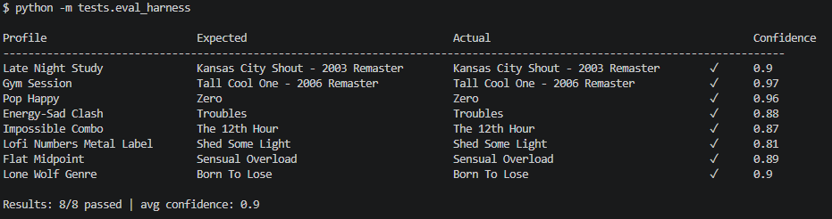

# Recster

Recster is an AI-powered music recommendation system built on top of VibeMatch, a rules-based song scoring project I built in Module 3 (Weeks 6 and 7 of CodePath's AI110 - Foundations of AI Engineering course). The original system worked, but it had one big usability problem: to get a recommendation you had to manually fill in twelve numeric preference values like `target_acousticness = 0.80` or `target_instrumentalness = 0.05`, which no real person thinks about.

Recster fixes that. You type a plain English description of what you want to hear (something like "chill music for studying late at night" or "high energy workout music") and a LangGraph agent powered by Llama 3.3 on Groq translates that into a structured music profile, runs it through the same content-based scoring engine, and surfaces the top 20 matching songs from a 2,460-song Spotify catalog.

The results come back in a Napster-style Win95 window built with React95, showing each song's score (how closely its audio features match your described vibe) alongside progress bar visualizations of all eleven audio features the scoring engine considers. A colored dot next to each result gives an at-a-glance read on that score (green for a strong alignment with your description, yellow for a partial one, red for a weak one.)

The whole pipeline is observable. Every intermediate step the agent takes is captured and can be streamed live to the UI so you can see the system's reasoning before the results appear.

---

## Stretch Features

- [x] **Agentic Workflow Enhancement**

  - [x] Multi-step reasoning with tool-calls and a decision-making chain is implemented
  - [x] The agent's intermediate steps are observable in output

- [x] **Test Harness / Evaluation Script**
  - [x] A script that evaluates the system on multiple predefined inputs is built and runs successfully
  - [x] The script prints a summary of results (pass/fail score, confidence, or similar)

---

## Demo

Click the thumbnail to watch the demo, or open it directly at https://youtu.be/qii8DqojV4M.

[](https://youtu.be/qii8DqojV4M)

---

## Original Project: VibeMatch

VibeMatch was a pure rule-based content-based music recommender — no LLM, no natural language input, nothing learned from data. The user defined a profile by manually specifying twelve preference values (genre, mood, and ten numeric targets like energy, valence, acousticness, and tempo), and the system scored every song in a hand-curated 20-song CSV catalog against that profile using a weighted formula.

The formula gave each song points based on how closely its audio features matched the user's targets, with categorical features like genre and mood scoring and numeric features scoring on a sliding closeness scale. The top five results by total score were returned along with a per-feature score breakdown so you could see exactly why each song ranked where it did. The entire interface was terminal-based. Profiles were hardcoded in Python and results printed to the console as a formatted table.

---

## Architecture Overview

Recster has three layers: a React frontend, a Flask API, and a LangGraph agent. The frontend is everything the user touches. Flask is thin. It validates the request, resets shared state, fires the agent, and formats the response. The agent is where all the actual work happens.



Guardrails run at two points in the agent loop: after `build_music_profile` and after `refine_music_profile`. Both call `validate_music_profile()` in `guardrails.py` before writing to the shared cache.

---

## Setup Instructions

### Prerequisites

- Python 3.10+
- Node.js 18+
- A free [Groq API key](https://console.groq.com)
- A free [LangSmith API key](https://smith.langchain.com) (optional — enables agent tracing)

### 1. Clone the repository

```bash
git clone <repo-url>
cd recster
```

### 2. Configure environment variables

Create a `.env` file in the project root. This file is listed in `.gitignore` and will not be committed.

```
GROQ_API_KEY=your_groq_api_key_here
LANGCHAIN_TRACING_V2=true
LANGCHAIN_API_KEY=your_langsmith_key_here
LANGCHAIN_PROJECT=recster
```

To disable LangSmith tracing, set `LANGCHAIN_TRACING_V2=false` and omit the remaining LangSmith keys.

### 3. Install Python dependencies

```bash
python -m venv .venv

# Windows
.venv\Scripts\activate

# macOS / Linux
source .venv/bin/activate

pip install -r requirements.txt
```

### 4. Install frontend dependencies

```bash
cd frontend
npm install
cd ..
```

### 5. Start the backend

From the project root:

```bash
python app.py
```

The Flask server will start on `http://localhost:5000`.

### 6. Start the frontend

In a separate terminal:

```bash
cd frontend
npm run dev
```

The Vite dev server will start on `http://localhost:5173`. It is pre-configured to proxy all `/recommend` requests to the Flask backend.

### 7. Open the application

Navigate to `http://localhost:5173`. Enter a description of the type of music you like in the search field and click **Find Songs**.

---

## Sample Interactions

### Input 1: "chill music for late night studying"



**Top result:** Stockholm Sweetnin' — Scott Hamilton  
**Score:** 14.64

---

### Input 2: "high energy workout music, something aggressive"



**Top result:** Forgiveness — Solomon Childs  
**Score:** 14.52

---

### Input 3: "happy upbeat pop for a sunny morning"



**Top result:** Zero  
**Score:** 16.12

---

## Design Decisions

**Why LangChain + Groq instead of the Claude API**

Both would have worked, but Groq offers a free tier perfect for demoing, which mattered during development when I was running the same query over and over while debugging tool call behavior. LangGraph's `create_react_agent` is also built specifically for multi-tool workflows like this one. The invoke pattern, tool message extraction, and streaming support all come out of the box.

**Why React95 and the Napster aesthetic**

The base project (VibeMatch) was terminal-only, which meant you had to be comfortable running Python to use it at all. One of my goals for Recster was to build a real UI so the app could work for anyone, not just people willing to run it locally.

In addition to that, I wanted a theme that would guide both the name and the visual style, something in the same space as music and song listings. Napster fit that immediately: it's a song list app with a distinctive legacy Windows look, and playing on the name "Napster" gave me "Recster".

React95 is a component library that reproduces that aesthetic faithfully, so the path from concept to implementation was direct. A Win95 table layout provides an answer to the display question cleanly: one row per song, one column per feature, progress bars for the 0–1 range values.

**Why content-based filtering over collaborative filtering**

Collaborative filtering needs user interaction data (play counts, skips, ratings) to find similarity between users. I don't have any of that. The Spotify catalog is a flat CSV of audio features with no behavioral data attached.

Content-based filtering works on the features alone, and every score is fully traceable. For any song in the results you can see exactly which feature contributed how many points. That traceability made testing and debugging much easier. When a result looked wrong, I could look at the per-feature breakdown and immediately see why.

**Starting with Llama 3.1 8B and why it created problems**

I started with `llama-3.1-8b-instant` because it's the fastest option on Groq's free tier and it had the largest token limit. It mostly worked, but it had one specific failure mode: it would batch multiple tool calls into a single reasoning turn and try to run them in parallel before earlier tools had finished. That meant `get_recommendations` would start running before `build_music_profile` had written anything to the shared cache.

To work around this, I redesigned every tool to accept only `description: str` as its argument, with all inter-tool data flowing through module-level variables instead. The threading events and module-level caches in `agent.py` exist entirely as a defensive response to this 8B batching behavior.

**Upgrading to Llama 3.3 70B**

After the 8B workarounds were in place and the agent was stable, I swapped to `llama-3.3-70b-versatile`. Every behavioral issue disappeared immediately. No more parallel tool batching, no `refine_music_profile` calls when evaluation had already passed, no hallucinated arguments. The threading events and caches are still in the code as correctness guarantees, but in practice the 70B model follows the system prompt reliably enough that they rarely need to activate.

The lesson I took from this was that model capability and architectural complexity directly trade off against each other. A lot of the defensive engineering I wrote for the 8B model turned out to be unnecessary once I had a model that could actually follow multi-step instructions.

**Streaming agent steps to the UI in real time**

ChatGPT and Gemini both show you what they're doing while they work ("Searching the web...", "Reading document...") and at this point users expect that kind of transparency from agentic interfaces. If the app just spins for several seconds and then returns results with no indication of what happened, its harder to trust the results.

The steps data was already being captured internally (every tool's name and output were already in the `steps` array on the `/recommend` response), so it was more about surfacing it live than adding new functionality.

The streaming path uses Server-Sent Events over a second endpoint (`/recommend/stream`) rather than WebSockets because the data only flows one direction. The agent pushes steps to the client and the client never sends anything mid-stream. SSE handles that cleanly over standard HTTP with no additional server-side libraries needed.

---

## Testing Summary

### Unit and Integration Tests





### Eval Harness



The guardrail tests cover three failure categories: out-of-range float values (`target_energy: 1.8`), unknown genre strings (`"bossa nova"`), and missing required fields. All three raise `ValueError` with a descriptive message so the agent can catch and surface the error rather than silently passing a bad profile to the scorer.

The eval harness runs all 8 profiles from `recipe.py` (three standard profiles and five adversarial ones) through the scoring engine against the full 2,460-song catalog and checks each top result against a hardcoded expected title. The adversarial profiles include contradictory genre/mood combinations and edge cases like a flat all-0.5 profile. The harness exits with a non-zero code if fewer than 6/8 profiles pass, making it usable in CI.

---

## Reflection

**How I used AI during development**

I used Claude Code throughout the project for planning, architecture design, and implementation. That collaboration covered every phase: drafting the initial system design, writing the LangGraph agent, building the guardrail layer, designing the React95 UI, implementing SSE streaming, and helping write sections of this README.

The process was closer to pairing with a senior engineer than using a tool. I'd describe a problem or a goal, we'd work through the tradeoffs together, I'd ask follow-up questions, green-light an approach, and then I'd review and approve each change before it went in.

**One helpful suggestion**

The most useful specific suggestion was the `_nearest_valid` fuzzy matching approach in `agent.py`. The problem was that the LLM would occasionally return a genre or mood that was close to a valid catalog value but not an exact match, something like `"lo-fi"` instead of `"lofi"`, or `"mellow"` instead of `"melancholic"`. Without correction, these would hit `validate_music_profile()` and raise a `ValueError`, crashing the tool.

The suggestion was to use Python's `difflib.get_close_matches` to silently snap the value to the nearest valid catalog entry before validation runs, so the pipeline keeps moving instead of failing on a near-miss. That turned what would have been a recurring crash into a non-event. The correction happens invisibly and the user never sees it.

**One flawed suggestion**

The initial AI plan recommended using `llm.with_structured_output(MusicProfile)` in `music_profile_builder.py` to force the LLM to return a Pydantic-validated profile. On paper this is the clean approach.

LangChain's structured output uses the Pydantic model's schema to constrain the LLM response. In practice, when I switched to `llama-3.3-70b-versatile`, the model started returning numeric fields as strings (`"0.3"` instead of `0.3`). Groq's schema validator rejected those responses with a 400 error before Pydantic ever got a chance to coerce the types, so the structured output wrapper (which was supposed to handle exactly this) wasn't actually helping.

The fix was to drop `with_structured_output` entirely, use a direct `_llm.invoke()` call with a JSON-format system prompt, parse the response with `json.loads`, and apply explicit `float()` / `int()` coercion manually. It's more verbose but it works. The suggestion wasn't wrong in principle, it just didn't account for how Groq validates responses server-side before passing them to Pydantic.

**Limitations of current application and future improvements**

The catalog is 2,460 songs, which sounds like a lot until you search for something niche and see the same artists cycling through the results. A bigger and more diverse catalog would make the recommendations meaningfully better.

The `evaluate_results` check uses an `OR` condition (if the top result matches either the target genre or the target mood, it passes) which means `refine_music_profile` almost never fires in practice. I tested four deliberately mismatched descriptions ("angry classical music", "euphoric blues") and every single one returned `passed: true` because the numeric scoring weights (energy is weighted 5.0x) dominate and pull results toward the mood match regardless of genre. That means the self-correction loop in the agent design is more of a theoretical robustness guarantee than a real behavioral feature.

The most valuable thing I could add would be a feedback mechanism — a thumbs up/down on individual results that feeds back into future scoring, shifting the system from pure content-based filtering toward something that actually learns from what each user likes. Right now every search starts from scratch with no memory of what worked before.
