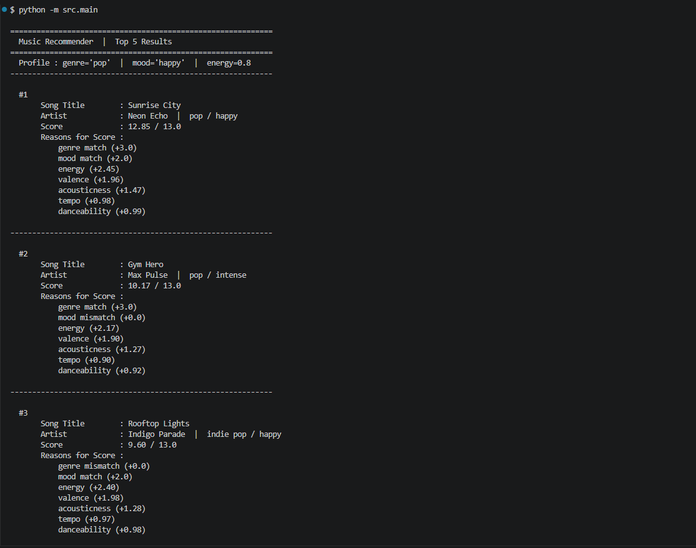
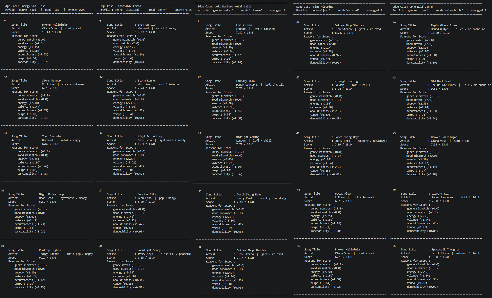

# 🎵 Music Recommender Simulation

## Project Summary

In this project you will build and explain a small music recommender system.

Your goal is to:

- Represent songs and a user "taste profile" as data
- Design a scoring rule that turns that data into recommendations
- Evaluate what your system gets right and wrong
- Reflect on how this mirrors real world AI recommenders

Replace this paragraph with your own summary of what your version does.

---

## How The System Works

Real-world recommenders like Spotify or YouTube use two main strategies: **collaborative filtering** (surfacing what similar users enjoyed) and **content-based filtering** (matching song attributes to a listener's taste profile). Production systems blend both, layer in engagement signals like skip rate and repeat plays, and continuously retrain on billions of data points. This simulation focuses entirely on **content-based filtering** — no user history, no social signals. It prioritizes transparency and interpretability: every score is the direct result of a weighted math formula comparing song attributes to a user's stated preferences, so you can always trace exactly why a song ranked where it did.

### Song Features

Each `Song` object stores the following attributes:

| Feature                 | Type        | Role in scoring                                            |
| ----------------------- | ----------- | ---------------------------------------------------------- |
| `genre`                 | categorical | Highest-weight match — penalizes catalog misses heavily    |
| `mood`                  | categorical | Second categorical signal for emotional context            |
| `energy`                | float (0–1) | Core numeric vibe driver; rewards closeness to user target |
| `valence`               | float (0–1) | Musical positivity — separates bright from dark/moody      |
| `acousticness`          | float (0–1) | Texture preference; organic vs. electronic feel            |
| `tempo_bpm`             | float       | Secondary rhythm signal; normalized before scoring         |
| `danceability`          | float (0–1) | Lowest weight; partially redundant with energy             |
| `id`, `title`, `artist` | metadata    | Display only — not used in scoring                         |

### UserProfile Features

Each `UserProfile` stores:

- `favorite_genre` — the genre the system treats as the user's primary identity
- `favorite_mood` — preferred emotional context (e.g., chill, intense, focused)
- `target_energy` — desired intensity level on a 0–1 scale
- `target_valence` — preferred emotional brightness on a 0–1 scale
- `target_acousticness` — texture preference; 1.0 = fully acoustic, 0.0 = fully electronic
- `target_tempo_bpm` — preferred beats per minute; normalized to 0–1 before scoring
- `target_danceability` — preferred rhythmic drive on a 0–1 scale

Profiles are defined in `src/recipe.py` and imported into `src/main.py`.

---

### Algorithm Recipe

The system scores every song in the catalog against the active user profile, then returns the top K by score. The full formula for a single song is:

```
score = 3.0 × (song.genre == user.genre)
      + 2.0 × (song.mood  == user.mood)
      + 2.5 × (1 − |song.energy       − user.target_energy|)
      + 2.0 × (1 − |song.valence      − user.target_valence|)
      + 1.5 × (1 − |song.acousticness − user.target_acousticness|)
      + 1.0 × (1 − |norm(song.bpm)    − norm(user.target_tempo_bpm)|)
      + 1.0 × (1 − |song.danceability − user.target_danceability|)

Maximum possible score = 13.0
Tempo is normalized: norm(bpm) = (bpm − 54) / (152 − 54)
```

**Weight rationale:**

| Feature        | Weight | Why this value                                                                                                                                                                                                                        |
| -------------- | ------ | ------------------------------------------------------------------------------------------------------------------------------------------------------------------------------------------------------------------------------------- |
| `genre`        | 3.0    | Hardest filter. With 10 genres in the catalog, a genre mismatch signals a fundamental incompatibility in production style and instrumentation. A wrong-genre song must never outscore a right-genre song on numeric similarity alone. |
| `energy`       | 2.5    | The single most discriminating numeric axis. It cleanly separates the catalog from 0.18 (classical) to 0.98 (metal). A 0.5-unit miss costs 1.25 points.                                                                               |
| `mood`         | 2.0    | Important but partially redundant with energy and valence. Raised above the common starting point of 1.0 so it acts as a meaningful tiebreaker, not just a footnote.                                                                  |
| `valence`      | 2.0    | Emotional brightness is independent of energy. A sad soul ballad and a chill lofi track can share similar energy but feel completely different.                                                                                       |
| `acousticness` | 1.5    | Texture preference is real but secondary — a lofi listener tolerates mild electronic production far more than a genre mismatch.                                                                                                       |
| `tempo_bpm`    | 1.0    | Useful secondary signal, but the same BPM can feel very different across genres. Genre already handles that context.                                                                                                                  |
| `danceability` | 1.0    | Most correlated with energy in this catalog. Low weight prevents double-counting intensity.                                                                                                                                           |

**Ranking rule:** Score all 20 songs, sort by score descending, return the top K. Ties are broken by catalog order.

See `src/recipe.py` for the `WEIGHTS` dictionary and `flowchart.md` for a visual diagram of the full data flow.

---

### Known Biases and Limitations

- **Genre over-prioritization.** Genre carries 3.0 out of 13.0 possible points — the single largest weight. A song that perfectly matches the user's energy, mood, valence, and acousticness but belongs to a different genre will always lose to a genre-matching song that only loosely fits numerically. This can bury genuinely good cross-genre recommendations.

- **Mood rigidity.** Mood matching is binary: "chill" and "relaxed" score the same as "chill" vs. "metal" — zero points either way. In practice these moods are close neighbors, but the system treats them as equally wrong. A mood similarity gradient (rather than exact match) would fix this.

- **Cold-start on user preferences.** The system requires the user to explicitly specify all seven preference values. A real user rarely thinks in terms of `target_acousticness = 0.80`. Any inaccurate self-reported preference directly degrades recommendation quality.

- **Catalog bias.** The 20-song catalog was hand-curated and reflects a narrow slice of genres and moods. Genres with multiple entries (lofi has 3) get more chances to score well than genres with one entry (blues, reggae, soul). This inflates recall for over-represented genres.

- **No diversity enforcement.** The ranking rule returns the top K by score alone. For a strong lofi profile all five recommendations could be lofi songs — correct by the math, but potentially monotonous in practice.

---

## Getting Started

### Setup

1. Create a virtual environment (optional but recommended):

   ```bash
   python -m venv .venv
   source .venv/bin/activate      # Mac or Linux
   .venv\Scripts\activate         # Windows

   ```

2. Install dependencies

```bash
pip install -r requirements.txt
```

3. Run the app:

```bash
python -m src.main
```

### Running Tests

Run the starter tests with:

```bash
pytest
```

You can add more tests in `tests/test_recommender.py`.

---

## Sample Output



---

## Adversarial Profile Stress Test



**Energy-Sad Clash** — Broken Hallelujah still lands #1 at 10.43 despite a brutal energy penalty. The combined 5.0 points from genre+mood was too large to overcome even with terrible numeric fit.

**Impossible Combo** — Iron Curtain (metal/angry) takes #1. It couldn't match the classical genre, but it was the only song with `mood="angry"`, so its 2.0 mood bonus put it ahead of every other song competing on numerics alone. Moonlight Study (the one classical song) barely squeaks into #5 — its genre match was wiped out by terrible numeric alignment.

**Lofi Numbers, Metal Label** — The most revealing result. Iron Curtain is nowhere in the top 5. The 3.0 genre bonus wasn't enough to save it because its numerics were the polar opposite of the targets. Lofi songs took the top 3 on pure numeric closeness alone — the genre weight lost.

**Flat Midpoint** — Coffee Shop Stories dominates at 11.42. Being the only jazz/relaxed song meant a guaranteed 5.0 categorical head start that the mid-range numerics couldn't overcome.

**Lone Wolf Genre** — Empty Glass Blues scores a perfect 13.0/13.0. The profile was tuned directly against its values, confirming the math works correctly end-to-end.

---

## Experiments You Tried

Use this section to document the experiments you ran. For example:

- What happened when you changed the weight on genre from 2.0 to 0.5
- What happened when you added tempo or valence to the score
- How did your system behave for different types of users

---

## Limitations and Risks

Summarize some limitations of your recommender.

Examples:

- It only works on a tiny catalog
- It does not understand lyrics or language
- It might over favor one genre or mood

You will go deeper on this in your model card.

---

## Reflection

Read and complete `model_card.md`:

[**Model Card**](model_card.md)

Write 1 to 2 paragraphs here about what you learned:

- about how recommenders turn data into predictions
- about where bias or unfairness could show up in systems like this

---

## 7. `model_card_template.md`

Combines reflection and model card framing from the Module 3 guidance. :contentReference[oaicite:2]{index=2}

```markdown
# 🎧 Model Card - Music Recommender Simulation

## 1. Model Name

Give your recommender a name, for example:

> VibeFinder 1.0

---

## 2. Intended Use

- What is this system trying to do
- Who is it for

Example:

> This model suggests 3 to 5 songs from a small catalog based on a user's preferred genre, mood, and energy level. It is for classroom exploration only, not for real users.

---

## 3. How It Works (Short Explanation)

Describe your scoring logic in plain language.

- What features of each song does it consider
- What information about the user does it use
- How does it turn those into a number

Try to avoid code in this section, treat it like an explanation to a non programmer.

---

## 4. Data

Describe your dataset.

- How many songs are in `data/songs.csv`
- Did you add or remove any songs
- What kinds of genres or moods are represented
- Whose taste does this data mostly reflect

---

## 5. Strengths

Where does your recommender work well

You can think about:

- Situations where the top results "felt right"
- Particular user profiles it served well
- Simplicity or transparency benefits

---

## 6. Limitations and Bias

Where does your recommender struggle

Some prompts:

- Does it ignore some genres or moods
- Does it treat all users as if they have the same taste shape
- Is it biased toward high energy or one genre by default
- How could this be unfair if used in a real product

---

## 7. Evaluation

How did you check your system

Examples:

- You tried multiple user profiles and wrote down whether the results matched your expectations
- You compared your simulation to what a real app like Spotify or YouTube tends to recommend
- You wrote tests for your scoring logic

You do not need a numeric metric, but if you used one, explain what it measures.

---

## 8. Future Work

If you had more time, how would you improve this recommender

Examples:

- Add support for multiple users and "group vibe" recommendations
- Balance diversity of songs instead of always picking the closest match
- Use more features, like tempo ranges or lyric themes

---

## 9. Personal Reflection

A few sentences about what you learned:

- What surprised you about how your system behaved
- How did building this change how you think about real music recommenders
- Where do you think human judgment still matters, even if the model seems "smart"
```
